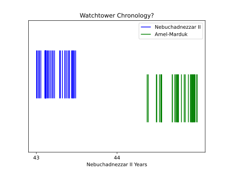

# Criticism of the Business Tablet Record

## Watchtower 2011

The Watchtower 2011 [@watch2011when2, 23] claims that the dates found in the business tablets must indicate that the
record is not complete, and the chronology should be extended over a greater number of years than currently allowed for.

### Nebuchadnezzar II to Amel-Marduk

The section starts by quoting R.H. Sack regarding an overlap between the last known tablets for Nebuchadnezzar and the
earliest known tablets for Amel-Marduk:

> **What have experts said?** R. H. Sack examined numerous business tablets from the Neo-Babylonian period. In 1972,
> Sack wrote that new unpublished British Museum texts placed at his disposal “completely upset” previous conclusions
> regarding the transition of rule from Nebuchadnezzar II to his son Amel-Marduk (also known as
> Evil-merodach).6 How so? Sack knew that tablets showed Nebuchadnezzar II to be still ruling in the sixth
> month of his last (43rd) year. But these newly deciphered tablets from the accession year of the following king,
> Amel-Marduk, were dated to the fourth and fifth months of what had been assumed to be the same year.7
> Clearly, there was a discrepancy.   6. Amel-Marduk 562-560 B.C.​—A Study Based on Cuneiform, Old Testament,
> Greek, Latin and Rabbinical Sources. With Plates, by Ronald H. Sack, published 1972, page 3.  7. The tablets BM
> 80920 and BM 58872 are dated in Evil-merodach’s fourth and fifth months of his accession year. These were published by
> Sack in Amel-Marduk 562-560 B.C.​—A Study Based on Cuneiform, Old Testament, Greek, Latin and Rabbinical Sources. With
> Plates, pages 3, 90, 106.

However, this isn't entirely correct; according to both C.B.F. Walker's unpublished list of corrections
[@walker1996corrections, 8] and the British Museum website [@bm80920] the date in BM 80920 is actually month 7 of
Amel-Marduk's accession year, rather than month 4, so this tablet does not overlap.

The Watchtower also claims that there is a tablet dated to month 10 of Nebuchadnezzar's 43rd year:

> **What do the documents show?** There are further discrepancies in the transition of one king to another. For example,
> the documents show that Nebuchadnezzar II was still ruling in his tenth month​—six months after his successor is
> assumed to have begun reigning.8   8. The tablet in the British Museum (BM 55806) is dated to the
> tenth month, 43rd year.

But this isn't entirely correct either, according to the both Walker's list [@walker1996corrections, 3] and the museum
website 'the year number is far from clear' [@bm55806], so it is not of much use for chronology. Hence, as already noted
in the [business tablets](../../standard/business/business.md#amel-marduk) section, in the context of the standard
chronology there are actually only two tablets overlapping by about a month:

Despite citing Sack's book, the Watchtower neglects to mention his interpretation of the small overlap as indicating
'that Nebuchadrezzar bought his son into a co-regency before his death'.

<!-- TODO: Quote R.H. Sack -->

The Watchtower claims that this overlap is not logical, that there must instead be 'additional years' in between. But
since the Bible's internal chronology limits Nebuchadnezzar's reign to around 43 or 44 years anyway (because of
Jehoiachin's 37 years of captivity), the alternative chronology as implied by the Watchtower could only really add one
additional year here:

This would leave an unexplained 11-month gap between the last tablets dated to Nebuchadnezzar and first for Amel-Marduk,
which seems unusual given the substantial quantity discovered from the rest of their reigns.

### Amel-Marduk to Neriglissar

The Watchtower suggests a similar scenario for Amel-Marduk to Neriglissar:

> A similar discrepancy exists with the transition between Amel-Marduk and his successor,
> Neriglissar.9   9. Tablets BM 75106 and BM 61325 are dated in the seventh and tenth months of what is
> considered the last (second) year of the ruling king Evil-merodach. However, the tablet BM 75489 is dated in the
> second month of the accession year of Neriglissar, his successor.​—Catalogue of the Babylonian Tablets in the British
> Museum, Volume VIII, (Tablets From Sippar 3) by Erle Leichty, J. J. Finkelstein, and C.B.F. Walker, published 1988,
> pages 25, 35.  Catalogue of the Babylonian Tablets in the British Museum, Volume VII, (Tablets From Sippar 2) by
> Erle Leichty and A. K. Grayson, published 1987, page 36.  Neriglissar​—King of Babylon, by Ronald H. Sack,
> published 1994, page 232. The month on the tablet is Ajaru (second month). 

This isn't entirely correct either, BM 75106 is actually dated to month 4 'not month 7 as stated in CBT' [@bm75106]
[@walker1996corrections, 7] so is not an issue, but nevertheless two anomalous tablets do overlap — see the
[business tablets](../../standard/business/business.md#neriglissar) section for further discussion.

### Cyrus II to Cambyses II

The Watchtower claims that the overlaps in the business tablets indicate that the record is not continuous, and thus not
reliable for chronological purposes.

> Why are these discrepancies significant? As mentioned earlier, gaps in the history documented by the Babylonian
> chronicles suggest that we may not have a continuous chronological record. Could others have ruled between the reigns
> of these kings? If so, additional years would have to be added to the Neo-Babylonian period.

> When the years that these kings ruled are totaled and a calculation is made back from the last Neo-Babylonian king,
> Nabonidus, the date reached for the destruction of Jerusalem is 587 B.C.E. However, this method of dating works only
> if each king followed the other in the same year, without any breaks in between.

But strangely absent from the article is any mention of the overlapping tablets between
[Cyrus II and Cambyses II](../../standard/business/business.md#cambyses-ii), if we assume the Watchtower's hypothesis is
correct, it would imply either Cyrus II ruled for more than 9 years, or there could have been another ruler between.

This leads to a massive contradiction, because in part 1 of the same article, the Watchtower quotes the very same
overlapping business tablets as a key source for deducing the length of Cyrus II's reign to be 9 years long, and with it
establish their entire chronology [@watch2011when1, 28].

## References
