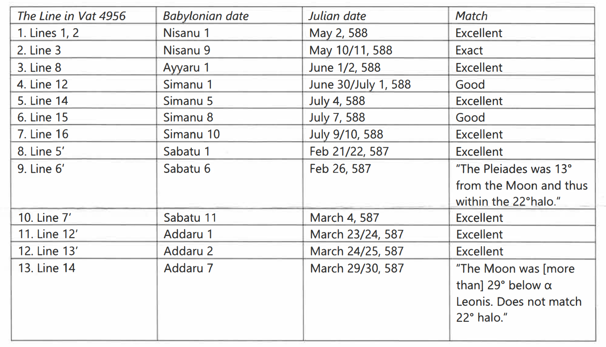
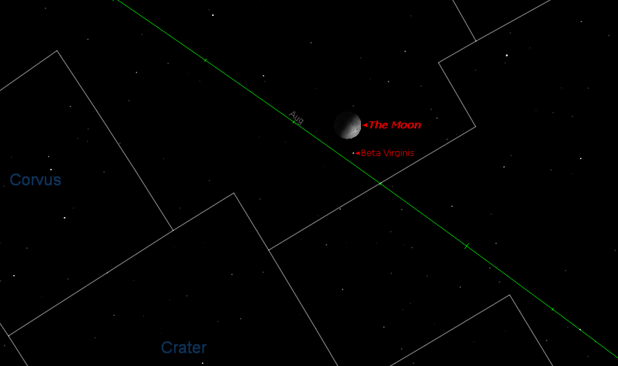
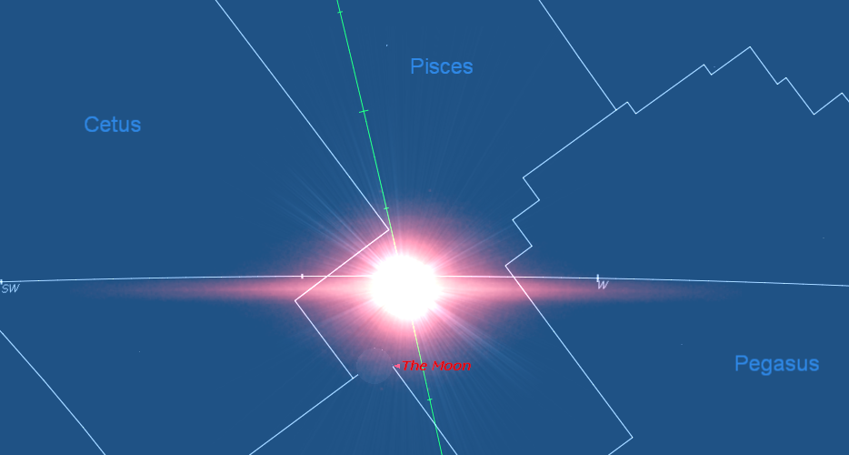
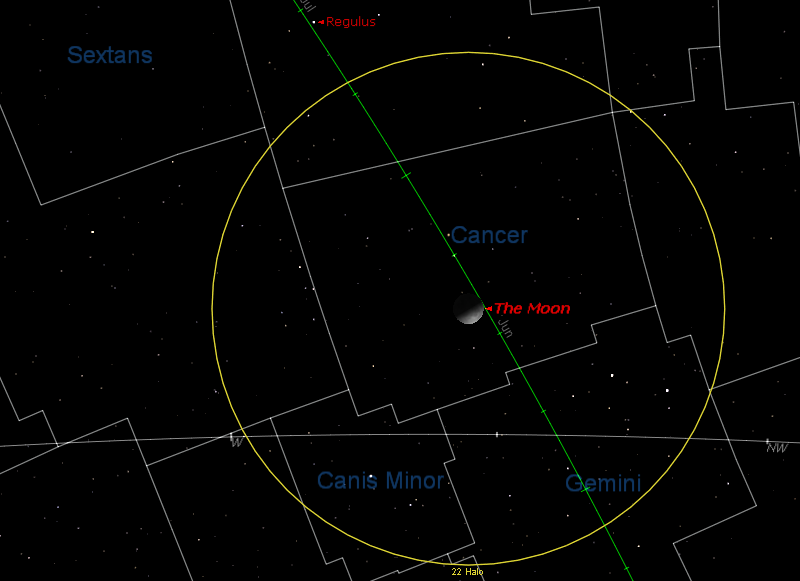

# Alternative Dating of VAT 4956

The 2011 _Watchtower_ article 'When Was Ancient Jerusalem Destroyed?' claims that
[VAT 4956](https://github.com/jacob-pro/astro-tablets/blob/master/documents/vat4956.md) can actually be dated to 588 BC
[@watch2011when2, 26]:

> Clearly, much of the astronomical data in VAT 4956 fits the year 588 B.C.E. as the 37th year of Nebuchadnezzar II.
> This, therefore, supports the date of 607 B.C.E. for Jerusalem’s destruction​—just as the Bible indicates.

## Exclusion of the Planetary Observations

The Watchtower has chosen to exclude the planetary observations from their analysis [@watch2011when2, 28]:

> Though the cuneiform sign for the moon is clear and unambiguous, some of the signs for the names of the planets and
> their positions are unclear. (Mesopotamian Planetary Astronomy​—Astrology, by David Brown, published 2000, pages
> 53-57) Because of this, the planetary observations are open to speculation and to several different interpretations.
> Since the moon can easily be tracked, the positions of those other celestial bodies mentioned on VAT 4956 and
> connected to the moon can be identified and their positions dated with a good measure of certainty.  ... 
> Because the cuneiform signs for many of the planetary positions are open to speculation and to several
> interpretations, these positions were not used in this survey to pinpoint the year intended by this astronomical
> diary.

But the reference to Brown is taken out of context, he actually arranges the planet names into groups
[@brown2000mesopotamian, 54]:

> I have found that all the names attested for the seven planets in the period c. 750-612 BC can be placed into five
> categories. For example, the names Sagmegar, Delebat, Ṣalbatānu, Šiḫṭu, Kaiamānu, Šamšu and Sîn are unique to Jupiter,
> Venus, Mars, Mercury, Saturn, the Sun and the Moon respectively. They are never used for any other celestial bodies.
> They are what I am terming the "A-names" for these planets.

Within the text of VAT 4956 all the planetary observations refer to the planets by their unambiguous 'A-names'
[@ossendrijver2016translating, 144], so the exclusion is completely unjustified.

## Exclusion of the Lunar Six Observations

The Watchtower has also chosen to exclude the lunar six observations [@watch2011when2, 28]:

> 18a. These time intervals (“lunar threes”) are the measurement of time from, for example, sunset to moonset on the
> first day of the month and during two other periods later in the month. Scholars have tied these time measurements to
> calendar dates. (“The Earliest Datable Observation of the Aurora Borealis,” by F. R. Stephenson and David M. Willis,
> in Under One Sky​—Astronomy and Mathematics in the Ancient Near East, edited by John M. Steele and Annette Imhausen,
> published 2002, pages 420-428) For ancient observers to measure this period required some sort of clock. Such
> measurements were not reliable. (Archimedes, Volume 4, New Studies in the History and Philosophy of Science and
> Technology, “Observations and Predictions of Eclipse Times by Early Astronomers,” by John M. Steele, published 2000,
> pages 65-66) On the other hand, calculating the position of the moon in relation to other celestial bodies was done
> with greater certainty.

The reference to Steele is also out of context, he does not imply that the measurements are entirely unreliable rather
he explains the typical range of accuracy for eclipse time measurements [@steele2000observations, 66]:

> To summarize, it appears that the Babylonian astronomers used the same clepsydras to measure the time of first contact
> relative to sunrise or sunset as they did for the durations of the various phases of the eclipses, and that the same
> clocks were used for their observations of both lunar and solar eclipses. There was no noticeable improvement in the
> accuracy of these clocks over the whole of the Late Babylonian period, despite an improvement in the precision with
> which the Babylonians quoted their times in the middle of the sixth century Be. These clocks were subject to random
> errors in drift arising from the fact that they could only be rated to an accuracy of about 8½%, and could only be
> read with an accuracy of about 3° (12 minutes). Thus a typical Babylonian eclipse timing of about 40° (2 hours 40
> minutes) has an accuracy of just under 7° (24 minutes).

Steele clearly does not consider the eclipse timings useless, for example he uses them as one factor in dating a text
[@steele2000observations, 39]:

> On 19 May 557 BC Mercury would have set during the eclipse and so would probably not have been visible. Also the
> timings given in the report are very different to those given by modern computations. On 30 April 59 AD Mercury, Venus
> and Sirius would have been above the horizon but Mercury would be too faint (mag. = +0.5) to be visible as the
> computed magnitude of this eclipse was only 0.96. There is also a poor agreement between the recorded and computed
> time of the eclipse. Thus this date may also be discarded. The computed circumstance of the eclipse on 30 June 10
> BC is in excellent agreement with the observed details of the eclipse. Mercury, Venus and Sirius were all visible
> during the eclipse. There is also good agreement between the recorded and computed times. By computation, the eclipse
> began at a local time of 12.80 hours. This corresponds to about 95° before sunset, very close to the 90° quoted in the
> last line of the tablet. The eclipse is computed to have lasted for about 40°, slightly shorter than the 48° given for
> the total duration in the tenth line. However, errors of this size in the timing of eclipses are in no way unusual. It
> is therefore possible to confidently assign this date to the observation on this tablet.

Furthermore, it should be noted that the pages referenced by the Watchtower concern the timings of lunar eclipses, it
would have been far more appropriate to cite pages 47-51 where Steele documents the accuracy of the lunar six timings
themselves. The mean error is around 1-2° (1° = 4 minutes) [@steele2000observations, 51].

See also [Steele's response](../../appendix/responses.md#j-m-steele) where he says he has been misrepresented by the
Watchtower regarding the lunar six measurements.

The accuracy of the lunar six measurements is demonstrated by BM 33066, the timings alone are
[sufficient to date the 7th year of Cambyses II to 523 BC](https://github.com/jacob-pro/astro-tablets/blob/master/results/bm33066_lunar_six_scores.txt)
(-522), a date and tablet which the Watchtower accepts and cites as a source. Surely this would not be possible if the
Babylonian clocks were wildly inaccurate?

Therefore, the Watchtower's complete dismissal of the lunar six timings is unwarranted.

## Start of the Year

The Watchtower seems to have attained better matches for the lunar observations by using an unconventional calendar for
the year:

> Therefore, the first Babylonian month (Nisanu) would have started the new year two months earlier, on May 2/3. While
> normally the year of this eclipse would have begun on April 3/4, VAT 4956 states on line 6 that an extra month
> (intercalary) was added after the twelfth (last) month (Addaru) of the preceding year. (The tablet reads: “8th of
> month XII2.”) Therefore, this made the new year actually not start until May 2/3. Thus, the date of this eclipse in
> 588 B.C.E. well fits the data on the tablet.

The Babylonian year begins at the first lunar visibility within about 30 days of the vernal equinox
[@ossendrijver2016translating, 131]. Therefore, the possible start dates for this year are either March 5/6 or April
3/4. May 3rd is unlikely since it is significantly later than 30 days after the equinox.

| First Visibility (Julian) | Sunset Time (UTC+3) | Days from Equinox |
| ------------------------- | ------------------- | ----------------- |
| -587-03-05                | 17:59               | -22               |
| -587-04-03                | 18:18               | 7                 |
| -587-05-03                | 18:36               | **37**            |

As noted by the Watchtower, the previous year had an intercalary month (Addaru II), so we can take the above dates and
count 13 months backwards to get the Nisan I date for 36th year of Nebuchadnezzar:

| Year 37 Nisan 1 | Year 36 Nisan 1 | Days from Equinox |
| --------------- | --------------- | ----------------- |
| -587-03-05      | -588-02-15      | **-41**           |
| -587-04-03      | -588-03-15      | -12               |
| -587-05-03      | -588-04-14      | 18                |

But as shown from the table, the Watchtower is incorrect, the fact that the 36th year had an intercalary month does not
invalidate the April 3/4 start date, instead it rules out the March 5/6 start date.

During this period intercalary months were inserted by royal decree such that the new year would not start much earlier
than Spring (late March and early April) [@dubberstein1956babylonian, 1], it would make no sense for a month to be added
to a year that already begun midway through April. Furthermore, if we count further backwards from the Watchtower's date
for the 37th year, then it would force the 34th year to also begin in May, 41 days later than the equinox:

| Nebuchadnezzar | Intercalary | Nisan 1    | Days from Equinox |
| -------------- | ----------- | ---------- | ----------------- |
| Year 33        | Addaru II   | -591-04-18 | 22                |
| Year 34        | No          | -590-05-07 | **41**            |
| Year 35        | No          | -589-04-26 | 30                |
| Year 36        | Addaru II   | -588-04-14 | 18                |
| Year 37        | No          | -587-05-03 | **37**            |

Therefore, the Watchtower's starting month for VAT 4956 is highly improbable, and the supporting explanation is based on
a flawed understanding of the calendar.

## Start of the Months

The information contained within the article was not alone sufficient in order to replicate their results, so I sent a
letter requesting further information. The Watchtower [replied](../../appendix/letter_vat4956.md), and provided me with
the following table:

The first problem I noticed is that the Watchtower is beginning the months too early. The Babylonian month started 'at
the first appearance of the lunar crescent after sunset', or up to one day later if it was not observed
[@ossendrijver2016translating, 131] [@dubberstein1956babylonian, 1]. Comparing to the first visibility dates provided by
Parker and Dubberstein and data computed using Alcyone PLSV [@alcyoneplsv], we can see the Watchtower starts four of
five the months before the moon was visible (note all dates in the table refer to the date of sunset):

| Watchtower Babylonian | Watchtower Julian | First Visibility (P&D Tables) | First Visibility (PLSV Defaults) |
| --------------------- | ----------------- | ----------------------------- | -------------------------------- |
| Nisanu 1              | **-587-05-02**    | -587-05-03                    | -587-05-03                       |
| Aiaru 1               | -587-06-01        | -590-06-01                    | -590-06-01                       |
| Simanu 1              | **-587-06-30**    | -589-07-01                    | -589-07-01                       |
|                       |                   |                               |                                  |
| Shabatu 1             | **-586-02-21**    | -586-02-23                    | -586-02-23                       |
| Addaru 1              | **-586-03-23**    | -586-03-24                    | -586-03-24                       |

In light of this I do not think it is fair to describe the matches within those four months as 'exact' or 'excellent'
given that it is unlikely the Babylonians would have been able to observe the moon that early.

## Lunar Observations

The Watchtower claims that the lunar observations fit 588 BC better than 586 BC [@watch2011when2, 28]:

> While not all of these sets of lunar positions match the year 568/567 B.C.E., all 13 sets match calculated positions
> for 20 years earlier, for the year 588/587 B.C.E.

However, after testing their dates I do not believe this is an entirely accurate claim; overall there are arguably more
discrepancies (bold) for the Watchtower's dates, compared to the single error in the standard chronology.

| WT  | Calendar Date | Event                            | WT Date    | Comment                        | ADT Date   | Comment                          |
| --- | ------------- | -------------------------------- | ---------- | ------------------------------ | ---------- | -------------------------------- |
| 1   | 1/I/37        | Moon appeared behind Taurus      | -587-05-02 | Moon 10° behind ε Tauri        | -567-04-22 | Moon 6.5° behind of ε Tauri      |
| 2   | 9/I/37        | Moon 2.2° in front of β Virginis | -587-05-10 | Moon 2° **behind** β Virginis  | -567-04-30 | **Moon 11.1° behind β Virginis** |
|     |               |                                  |            |                                |            |                                  |
| 3   | 1/II/37       | Moon below β Geminorum           | -587-06-01 | Moon 10° below β Geminorum     | -567-05-22 | Moon 7.5° below β Geminorum      |
|     |               |                                  |            |                                |            |                                  |
| 4   | 1/III/37      | Moon appeared behind Cancer      | -587-06-30 | Moon 8° behind θ Cancri        | -567-06-20 | Moon 11.2° behind θ Cancri       |
| 5   | 5/III/37      | Moon was in Leo (uncertain star) | -587-07-04 | Moon 24° behind 52 Leonis      | -567-06-24 | Moon 34.1° behind 52 Leonis      |
| 6   | 8/III/37      | Moon 5.5° below β Librae (EW)    | -587-07-07 | **Moon 12° ahead of β Librae** | -567-06-27 | Moon 4.5° below β Librae         |
| 7   | 10/III/37     | Moon 7.7° above Antares (EW)     | -587-07-09 | Moon 11° above Antares         | -567-06-29 | Moon 8.5° above Antares          |
|     | 15/III/37     | Predicted Lunar Eclipse          | -587-07-14 | Partial eclipse 15th 8:52 AM   | -567-07-04 | Partial eclipse 4th 13:50 PM     |
|     |               |                                  |            |                                |            |                                  |
| 8   | 1/XI/37       | Moon appeared in Pisces          | -586-02-21 | Moon 20° ahead of 58 Piscium   | -566-02-12 | Moon 11.8° below 58 Piscium      |
| 9   | 6/XI/37       | Pleiades within Lunar Halo       | -586-02-26 | Alcyone 15° from Moon          | -566-02-17 | Alcyone 18.2° from Moon          |
| 9   | 6/XI/37       | Taurus within Lunar Halo         | -586-02-26 | ε Tauri 4° from Moon           | -566-02-17 | ε Tauri 8.5° from Moon           |
| 9   | 6/XI/37       | Auriga within Lunar Halo         | -586-02-26 | ν Aurigae 25° from Moon        | -566-02-17 | ν Aurigae 19.2° from Moon        |
| 10  | 7-15/XI/37    | Leo within Lunar Halo            | -586-03-04 | 52 Leonis 9° from Moon         | -566-02-22 | 52 Leonis 9° from Moon           |
| 10  | 7-15/XI/37    | Cancer within Lunar Halo         | -586-03-04 | θ Cancri 25° from Moon         | -566-02-22 | θ Cancri 23° from Moon           |
| 10  | 7-15/XI/37    | Regulus 2.2° below Moon          | -586-03-04 | Regulus 0.8° below Moon        | -566-02-22 | Regulus 2.8° below Moon          |
|     |               |                                  |            |                                |            |                                  |
| 11  | 1/XII/37      | Moon appeared behind Aries       | -586-03-23 | Moon 13° below ν Arietis       | -566-03-14 | Moon 10.5° below ν Arietis       |
| 12  | 2/XII/37      | Moon 8.8° below the Pleiades     | -586-03-24 | Moon 12° below Alcyone         | -566-03-15 | Moon 9.3° below Alcyone          |
| 13  | 7/XII/37      | Crab within Lunar Halo           | -586-03-29 | Moon 3.9° from θ Cancri        | -566-03-20 | Moon 5.7° from θ Cancri          |
| 13  | 7/XII/37      | Regulus within Lunar Halo        | -586-03-29 | **Moon 26° from Regulus**      | -566-03-20 | Moon 14.9° from of Regulus       |

### Issues

#### 2. Obv 3, Nisanu 9

The Watchtower is correct to say that angle matches -587-05-10 better than it does -567-04-30, the Moon is indeed 2° (1
cubit) apart from β Virginis at 21:00 (UTC+3):

But the Watchtower is wrong claiming that this is an 'exact' match on account of the fact that the Moon is clearly
behind β Virginis relative to the ecliptic (green line).

#### 6. Obv 15, Simanu 8

The tablet describes this observation as during the evening watch (the first third of the night), at sunset -587-07-07
the Moon is actually 12° ahead of β Librae, so neither the position nor angle are a particularly good fit:

#### 8. Rev 5, Shabatu 1

The tablet states that the Moon appeared in Pisces, however at sunset on -586-02-21 whilst the Moon was in the area of
Pisces it had already set, so was certainly not visible. As noted above, first visibility was not until 2 days later;
the month of Shabatu should not have begun this early.

#### 13. Rev 14/15, Addaru 7

On the night of -586-03-29 the closest Regulus (α Leonis) came to the Moon prior to Moonset was about 26°, outside the
radius of a 22° halo:

In their letter the Watchtower claims:

> NOTE: The word translated "halo" (_"tarbasu"_) is disputed. The word literally means "pen, fold." This word does not
> necessarily refer to spherical bodies, but refers to something that the moon is "in" or "inside," just as an animal is
> in a pen, and a pen need not be spherical. At times a halo may not be perfectly round but may have irregularities that
> can extend beyond the standard 22°.

But according to Hunger [@sachs1988adt, 33]:

> Akk. _tarbaṣu_ "pen, fold". Haloes are frequently described as "billowing" (_iqtur_, lit. "it smoked"). If a halo is
> not closed it is said to have a "gate" in a certain direction. The larger type of halo called _supu̅ru_ is not so far
> attested in diaries.

## Planetary Observations

The majority of the planetary observations don't even come close to matching on the Watchtower's dates (bold). In
contrast, every single one fits 568 BC, most of them to a high degree of accuracy:

| Calendar Date | Event                            | WT Date     | Comment                           | ADT Date    | Comment                            |
| ------------- | -------------------------------- | ----------- | --------------------------------- | ----------- | ---------------------------------- |
| 1/I/37        | Saturn in front of Pisces        | -587-05-02  | **Saturn 104° behind 58 Piscium** | -567-04-22  | Saturn 16.0° ahead of 58 Piscium   |
| 11/I/37       | Jupiter rose to daylight (AR)    | -587-05-12  | **Jupiter AR on Sept 10**         | -567-05-02  | Jupiter AR on April 30             |
|               |                                  |             |                                   |             |                                    |
| 1/II/37       | Saturn in front of Pisces        | -587-06-01  | **Saturn 108° behind 58 Piscium** | -567-05-22  | Saturn 14.4° ahead of 58 Piscium   |
| 3-5/II/37     | Mars was in the Praesepe         | -587-06-03+ | **Mars 135° behind 42 Cancri**    | -567-05-24+ | Mars was 0.3° above 42 Cancri      |
| 10/II/37      | Mercury rose in the west (EF)    | -587-06-10  | Mercury EF on June 05             | -567-05-31  | Mercury EF on June 01              |
| 10/II/37      | Mercury behind Gemini            | -587-06-10  | Mercury 19° behind ω Geminorum    | -567-05-31  | Mercury 4.3° behind ω Geminorum    |
| 18/II/37      | Venus 2.6° above Regulus         | -587-06-18  | **Venus 58° ahead of Regulus**    | -567-06-08  | Venus 1.5° above Regulus           |
|               |                                  |             |                                   |             |                                    |
| 1/III/37      | Mars 8.8° in front of Regulus    | -587-06-30  | **Mars 111° behind Regulus**      | -567-06-20  | Mars was 7.4° ahead of Regulus     |
| 1/III/37      | Mercury 8.8° in front of Regulus | -587-06-30  | Mercury was 4° behind Regulus     | -567-06-20  | Mercury was 7.7° ahead of Regulus  |
| 1/III/37      | Mercury passed below Mars        | -587-06-30  | **Mercury 107° ahead of Mars**    | -567-06-20  | Mercury 0.5° below Mars            |
| 1/III/37      | Jupiter was above Antares        | -587-06-30  | **Jupiter 139° behind Antares**   | -567-06-20  | Jupiter 5.2° above Antares         |
| 1/III/37      | Venus opposite θ Leonis          | -587-06-30  | **Venus 57° ahead of θ Leonis**   | -567-06-20  | Venus 8.5° below θ Leonis          |
| 12/III/37     | Mars 1.5° above Regulus          | -587-07-11  | **Mars 113° behind Regulus**      | -567-07-01  | Mars 1.0° above Regulus            |
|               |                                  |             |                                   |             |                                    |
| 19/X/37       | Venus below β Capricorni         | -586-02-10  | **Venus 82° behind β Capricorni** | -566-02-01  | Venus 4.1° below β Capricorni      |
|               |                                  |             |                                   |             |                                    |
| 1/XI/37       | Jupiter in Sagittarius           | -586-02-21  | **Jupiter 109° behind Ascella**   | -566-02-12  | Jupiter was 8.3° above Ascella     |
| 4/XI/37       | Venus 1.1° below Capricorn       | -586-02-24  | **Venus 90° behind η Capricorni** | -566-02-15  | Venus was 9.2° behind η Capricorni |
|               |                                  |             |                                   |             |                                    |
| 13-21/XII/37  | Mercury and Venus were together  | -586-04-04+ | **Venus 70° behind Mercury**      | -566-03-27  | Venus was 0.8° above Mercury       |
| 20/XII/37     | Venus entered Pisces             | -586-04-11  | **Venus 78° behind 58 Piscium**   | -566-04-02  | Venus 8.1° below 58 Piscium        |
| 20/XII/37     | Mercury entered Pisces           | -586-04-11  | Mercury 13° behind 58 Piscium     | -566-04-02  | Mercury 9.0° below 58 Piscium      |

## Lunar Six Observations

Nearly all the Lunar Six timings don't fit the Watchtower's dates (bold). It is not even a matter of 'unreliable
clocks', the four negative values indicate the ordering is actually wrong. For example on the Watchtower's date for
14/I/37 the moonset was 34 minutes before sunrise, where the text says it took place 16 minutes after sunrise. This is
further evidence that the Watchtower is starting the months too early. On the other hand, when using the standard dates
for 568 BC all the timings fit excellently:

| Calendar Date | Event                             | WT Date    | Time (UŠ)  | ADT Date   | Time (UŠ) |
| ------------- | --------------------------------- | ---------- | ---------- | ---------- | --------- |
| 14/I/37       | NA (sunrise to moonset) was 4°    | -587-05-15 | **-8.6°**  | -567-05-05 | 3.5°      |
| 26/II/37      | KUR (moonrise to sunrise) was 23° | -587-06-26 | 27.5°      | -567-06-16 | 22.7°     |
| 1/III/37      | NA (sunset to moonset) was 20°    | -587-06-30 | **5.3°**   | -567-06-20 | 22.4°     |
| 15/III/37     | NA (sunrise to moonset) was 7.5°  | -587-07-14 | **-1.6°**  | -567-07-04 | 7.9°      |
| 1/XI/37       | NA (sunset to moonset) was 14.5°  | -586-02-21 | **-8.6°**  | -566-02-12 | 16.9°     |
| 1/XII/37      | NA (sunset to moonset) was 25     | -586-03-23 | **3.6°**   | -566-03-14 | 25.6°     |
| 12/XII/37     | NA (sunrise to moonset) was 1.5°  | -586-04-03 | **-19.0°** | -566-03-25 | 0.3°      |

Note: 1° ('time degree') = 4 minutes.

## Conclusion

The Watchtower has effectively cherry-picked a favourable subset of the observations, whilst excluding the numerous
planetary and lunar six timings that strongly disprove their dates. Furthermore, among the lunar observations the
Watchtower has chosen to consider, they are only able to produce acceptable results by distorting the calendar beyond
what is probable, and even then it is not accurate to claim the 13 observations fit as well as they do for 568 BC.

## References
